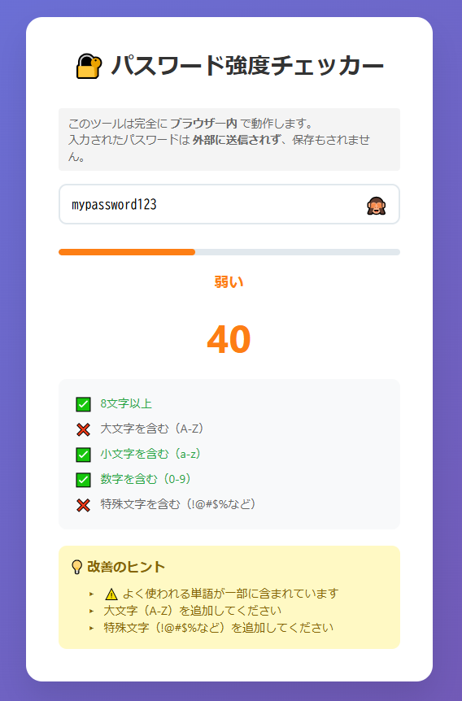
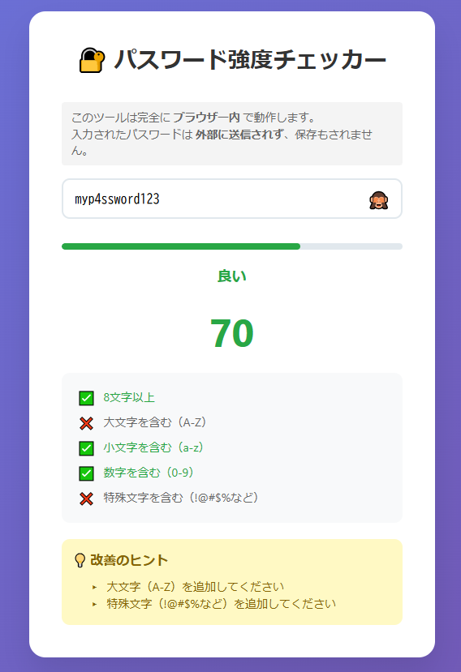

# 🔐 パスワード強度チェッカー

リアルタイムでパスワードの強度を評価する、日本語対応のWebアプリケーションです。

## 🌟 デモ

[https://ipusiron.github.io/password-checker/](https://ipusiron.github.io/password-checker/)

## 📸 スクリーンショット


## ✨ 機能

### 基本機能
- 🔍 **リアルタイム評価** - 入力と同時に強度を判定
- 📊 **視覚的な強度表示** - プログレスバーと色分けで直感的に理解
- 🔢 **スコア表示** - 0〜100点で数値化
- 👁️ **パスワード表示/非表示** - プライバシーを保護

### 評価基準
- ✅ 8文字以上（20点）
- ✅ 大文字を含む（A-Z）（20点）
- ✅ 小文字を含む（a-z）（20点）
- ✅ 数字を含む（0-9）（20点）
- ✅ 特殊文字を含む（!@#$%など）（20点）

### ボーナスポイント
- 12文字以上: +10点
- 16文字以上: +10点

### ペナルティ
- よく使われる危険なパスワード: -50点
- よく使われる危険なパスワードを含む: -30点
- 同じ文字の連続: -10点

> 🔸 よく使われる単語が**一部でも含まれている**場合も、危険と見なして -30点の減点対象となります。  
> たとえば `mypassword2024` のように `"password"` を含む文字列も安全とは言えないため、スコアが下がる仕様です。

### ⚖️ 部分一致による減点の調整

以前のバージョンでは、「よく使われる単語（例：`password`）を含む」だけで一律に -30点の減点が行われていました。

現在のバージョンでは、**長さや構成（大文字・記号の有無）を加味して減点幅を調整**しています。

| 条件                                         | 減点 |
|----------------------------------------------|------|
| 完全一致（例：`password123`）               | -50点 |
| 部分一致 & 12文字未満                       | -30点 |
| 部分一致 & 12〜15文字（中程度の構成）      | -10点 |
| 部分一致 & 16文字以上 & 構成が強い          | 減点なし（注意メッセージのみ） |

このように、**長くて複雑なパスワードは減点されにくく**なっており、実用的な安全性評価が可能です。

### 強度レベル
- 🔴 **非常に弱い** (0-20点)
- 🟠 **弱い** (21-40点)
- 🟡 **普通** (41-60点)
- 🟢 **良い** (61-80点)
- 🔵 **強力** (81-100点)

### パスワードの強度テスト

| パスワード           | 長さ | 小文字 | 数字 | 12文字以上 | 部分一致で減点 | 合計スコア  | 
|----------------------|------|--------|------|------------|----------------|-------------|
| `mypassword123`      | +20  | +20    | +20  | +10        |✅ -30点        | **40点**    |
| `myp4ssword123`      | +20  | +20    | +20  | +10        |❌ 減点なし     | **70点**    |




## 🚀 使い方

### オンラインで使用
1. [デモページ](https://ipusiron.github.io/password-checker/)にアクセス
2. パスワードを入力
※入力されたパスワードは外部に送信されず、保存もされません。安心してお使いください。
3. リアルタイムで強度を確認

### ローカルで使用
1. リポジトリをクローン
```bash
git clone https://github.com/ipusiron/password-checker.git
```

2. プロジェクトフォルダに移動
```bash
cd password-checker
```

3. `index.html`をブラウザで開く
```bash
open index.html  # macOS
start index.html # Windows
xdg-open index.html # Linux
```

## 🛠 技術スタック

- **HTML5** - 構造
- **CSS3** - スタイリング（グラデーション、トランジション）
- **JavaScript** (Vanilla) - ロジックとDOM操作
- **正規表現** - パスワードパターンの検証

## 🛡️ 当プログラムは安全です

### 🔒 セキュリティ保証バナー
このツールは完全にローカルで動作します。
- パスワードは外部に送信されません。
- ブラウザにも保存されません。
- 入力データは即座に破棄されます。

### 💡 それでも不安な方へ　より安心して使うためのヒント

- プライベートブラウジング（シークレットモード）で使用する。
- インターネットを切断しても使えます。
- プログラムをダウンロードして、ローカル環境で実行する。
- ブラウザーのデベロッパーツールやパケットキャプチャーツールでネットワーク監視する。

## カスタム辞書ファイルの利用

このツールでは、`common-passwords.txt` というリストファイルを使用して「よく使われるパスワード」と照合し、強度を評価しています。
一般の辞書ファイルと同様に、**「1行に1ワード」**形式のファイルをサポートしています。

### 🔹 代表的な辞書ファイル

このリストファイルは自由にカスタマイズ可能で、以下のようなパブリックな辞書ファイルを加工して使用できます。

- [SecLists（Payload系リスト集）](https://github.com/danielmiessler/SecLists)
  - パスワードリストは `Passwords/Common-Credentials/` や `Passwords/Leaked-Databases/` にあります。
  - 例：`10-million-password-list-top-1000.txt` など。

- [rockyou.txt（有名な流出パスワードリスト）](https://github.com/brannondorsey/naive-hashcat/releases/)
  - Asset内にある `rockyou.txt` がrockyouファイルです。容量が大きいので注意。
  - オリジナルは流出データに由来しますが、教育・研究目的での利用に限られます。

なお、辞書ファイルの詳細については[『ハッキング・ラボで遊ぶために辞書ファイルを鍛える本』](https://akademeia.info/?page_id=22508)を参照してください。
特に、rockyouファイルについては、第4章「rockyouファイルを考察する」（P.39-56）で取り上げています。

### 🔄 他の辞書ファイルを使いたい場合

大規模な辞書ファイル（例：`rockyou.txt`）から一部だけ取り出して使用することができます。

たとえば、先頭1000行を取り出して使いたい場合は、以下のコマンドを実行します。

```bash
head -n 1000 /path/to/rockyou.txt > common-passwords.txt
```

## ⚠️ ローカルでの動作とCORS制限について

本ツールは、`common-passwords.txt` を JavaScript の `fetch()` で読み込んで使用しています。  
このため、ローカル環境で `index.html` を直接ダブルクリックして `file://` スキームで開くと、以下のような **CORSエラー** が発生することがあります。

>Access to fetch at 'file:///.../common-passwords.txt' from origin 'null' has been blocked by CORS policy

### ✅ 回避策（いずれか）

#### 回避策① Python の HTTP サーバを使用する

ターミナルで次のように実行します。

```bash
python3 -m http.server 8000
```

その後、ブラウザで http://localhost:8000/index.html にアクセスします。

#### 回避策② VS Code + Live Server 拡張を使用

拡張機能「Live Server」をインストールする。

index.html を右クリック → 「Open with Live Server」

#### 回避策③ 任意の Web サーバでホスティングする

Apache、Nginx、GitHub Pages、Netlify などの一般的な HTTP サーバで公開すれば、fetch() は正常に動作します。

## 📝 ライセンス

[MIT License](LICENSE) - ご自由にお使いください。

## 👏 クレジット

- アイコン: ネイティブ絵文字を使用
- フォント: システムフォント
- カラーパレット: カスタムグラデーション

## 📞 連絡先

- GitHub: [@ipusiron](https://github.com/ipusiron)

---
