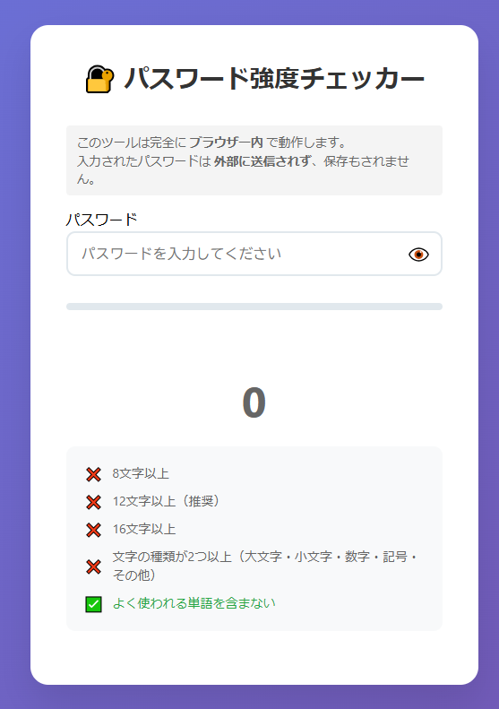
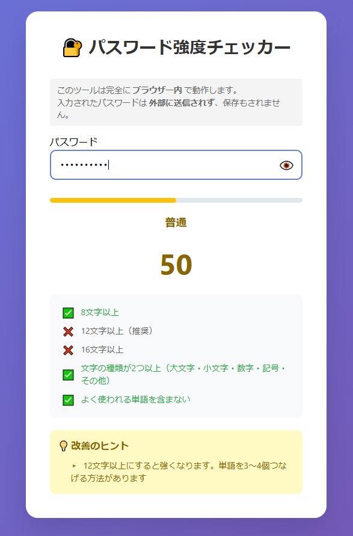
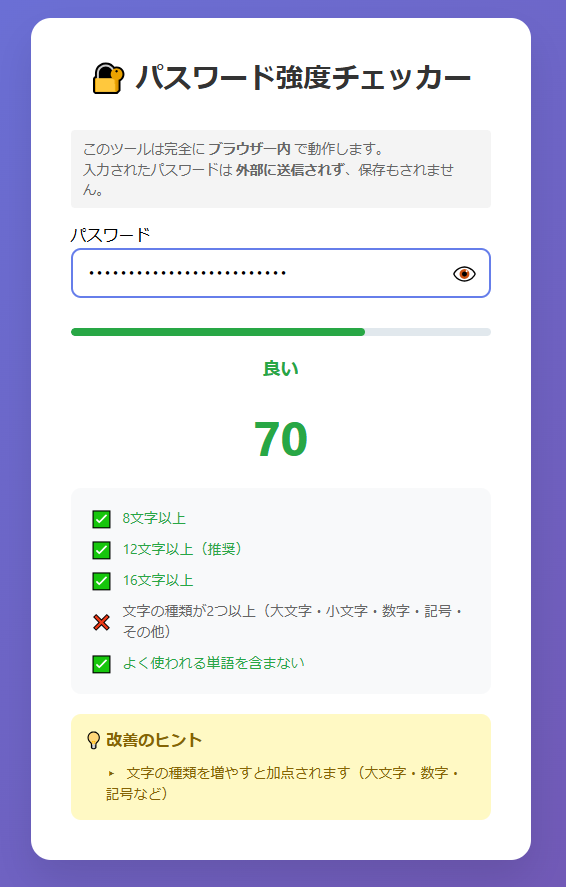

<!--
---
id: day001
slug: password-checker

title: "Password Checker"

subtitle_ja: "リアルタイムでパスワードの強度を評価"
subtitle_en: "Real-time password strength evaluation"

description_ja: "長さを重視した採点と辞書照合でパスワードの強度をリアルタイムに評価し、改善点を提案するWebツール"
description_en: "A web tool that evaluates password strength in real time with length-first scoring and dictionary checks, and suggests improvements"

category_ja:
  - 認証
category_en:
  - Authentication

difficulty: 1

tags:
  - password
  - security

repo_url: "https://github.com/ipusiron/password-checker"
demo_url: "https://ipusiron.github.io/password-checker/"

hub: true
---
-->

# Password Checker – パスワード強度チェッカー


[](https://ipusiron.github.io/password-checker/)

**Day001 - 生成AIで作るセキュリティツール200**

リアルタイムでパスワードの強度を評価する、日本語対応のWebアプリケーションです。

## 🌐 デモページ

[https://ipusiron.github.io/password-checker/](https://ipusiron.github.io/password-checker/)

## 📸 スクリーンショット

入力前の画面です。



50点・「普通」と評価された例です。



70点・「良い」と評価された例です。



## ✨ 機能

### 基本機能
- 🔍 **リアルタイム評価** - 入力と同時に強度を判定
- 📊 **視覚的な強度表示** - プログレスバーと色分けで直感的に理解
- 🔢 **スコア表示** - 0〜100点で数値化
- 👁️ **パスワード表示/非表示** - プライバシーを保護

### 評価基準

文字種より長さを重く見る方式に変更しました。
文字数はコードポイント数（`[...password].length`）で数え、サロゲートペアも1文字として扱います。

| 文字数 | 長さ点 |
|--------|--------|
| 0文字 | 0点（強度の表示なし） |
| 1〜7文字 | 0点（文字種にかかわらず合計も0点） |
| 8〜11文字 | 20点 |
| 12〜15文字 | 35点 |
| 16〜19文字 | 50点 |
| 20〜23文字 | 60点 |
| 24文字以上 | 70点 |

8文字以上の場合は、次の5分類のうち含まれる文字種の数で加点します。

- 小文字：`a-z`
- 大文字：`A-Z`
- 数字：`0-9`
- 記号：ASCII印字文字（U+0020〜U+007E）のうち英数字以外（スペース、バッククォート、チルダを含む）
- その他：U+007Eより大きいコードポイント（日本語、絵文字など）

| 文字種の数 | 文字種点 |
|------------|----------|
| 0〜1種 | 0点 |
| 2種 | 10点 |
| 3種 | 20点 |
| 4種以上 | 30点 |

制御文字（U+0000〜U+001F）は文字種の加点対象外ですが、文字数には含めます。
画面では次の5項目を確認できます。

- ✅ 8文字以上（`length8`）
- ✅ 12文字以上（推奨）（`length12`）
- ✅ 16文字以上（`length16`）
- ✅ 文字の種類が2つ以上（大文字・小文字・数字・記号・その他）（`variety2`）
- ✅ よく使われる単語を含まない（完全一致も部分一致もない場合、`noCommon`）

これらは各20点のチェック項目ではありません。
長さ点と文字種点から下記のペナルティを引き、合計は0〜100点に丸めます。

### ペナルティ

次の順に減点します。

1. 辞書と完全一致：-50点（部分一致の減点との重複なし）
2. 完全一致でない場合の部分一致：下表の条件で-30点、-10点、または減点なし
3. 同じ文字が3文字以上連続（`/(.)\1{2,}/u`）：-10点
4. 使われているコードポイントが3種類以下：-20点（上記の5分類とは別）
5. 連番：-10点（複数あっても1回のみ）

連番は、小文字化した入力で英字または数字が4文字以上、コードポイントで+1または-1ずつ続く並びです。
`abcd`、`dcba`、`1234`、`4321`のほか、キーボード配列`qwertyuiop`、`asdfghjkl`、`zxcvbnm`とその逆順の連続する4文字も対象です。

### ⚖️ 部分一致による減点の調整

| 部分一致の条件 | 減点 |
|----------------|------|
| 12文字未満 | -30点 |
| 12〜15文字 | -10点 |
| 16文字以上で、大文字と記号の両方は含まない | -10点 |
| 16文字以上で、大文字と記号を両方含む | 減点なし（ℹ️注意メッセージのみ） |

8文字未満では残りの必要文字数を、8〜11文字では12文字以上、12〜15文字では16文字以上にする改善ヒントを表示します。
文字種が1種なら文字種を増やすヒントも表示します。
減点の説明を先に、長さと文字種の改善ヒントを後に表示し、100点でも注意メッセージは省略しません。

### 強度レベル
- 🔴 **非常に弱い** (0-20点)
- 🟠 **弱い** (21-40点)
- 🟡 **普通** (41-60点)
- 🟢 **良い** (61-80点)
- 🔵 **強力** (81-100点)

## 🔬 評価方式の位置づけ

本ツールの採点は、長さを最も重く見る簡易的な教育用モデルです。
[NIST SP 800-63B-4（2025年8月）](https://pages.nist.gov/800-63-4/sp800-63b.html)は、大文字や記号などの構成要件を課さないこと、単独の認証要素として使うパスワードは15文字以上とすること、よく使われるパスワードのリストと照合することを求めています。
本ツールも長さと辞書照合を中心に採点し、文字の種類は加点にとどめています。
ただし、NISTのリスト照合はパスワード全体を対象とし、本ツールの部分一致減点や点数は独自のもので、NISTへの適合や実際の安全性を保証するものではありません。
実際にパスワードを決めるときは各サービスの規則に従い、パスワードマネージャーの生成機能を使うとよいでしょう。

### パスワードの強度テスト

| パスワード | 文字数 | 文字種 | 長さ点 | 文字種点 | 減点 | 合計スコア |
|------------|--------|--------|--------|----------|------|------------|
| `password` | 8 | 1種 | 20 | 0 | 完全一致 -50 | **0点** |
| `P@ssw0rd1!` | 10 | 4種 | 20 | 30 | なし | **50点** |
| `Tr0ub4dor&3` | 11 | 4種 | 20 | 30 | なし | **50点** |
| `mypassword123` | 13 | 2種 | 35 | 10 | 部分一致（password123）-10 | **35点** |
| `myp4ssword123` | 13 | 2種 | 35 | 10 | なし | **45点** |
| `correcthorsebatterystaple` | 25 | 1種 | 70 | 0 | なし | **70点** |
| `MyDogIsNamedRex2019!` | 20 | 4種 | 60 | 30 | なし | **90点** |
| `aaaaaaaaaaaaaaaaaaaaaaaa` | 24 | 1種 | 70 | 0 | 同じ文字の連続 -10、3種類以下 -20 | **40点** |
| `abcdefghijklmnop` | 16 | 1種 | 50 | 0 | 連番 -10 | **40点** |
| `CorrectHorse!Battery9Staple` | 27 | 4種 | 70 | 30 | なし | **100点** |

これらは動作確認用の公開例です。そのまま実際のパスワードには使わないでください。

## 📖 使い方

### オンラインで使用
1. [デモページ](https://ipusiron.github.io/password-checker/)にアクセス
2. パスワードを入力
   - 入力されたパスワードは外部に送信されず、本ツールによる保存もしない。
3. リアルタイムで強度を確認

### ローカルで使用
1. リポジトリをクローン
```bash
git clone https://github.com/ipusiron/password-checker.git
```

2. プロジェクトフォルダーに移動
```bash
cd password-checker
```

3. HTTPサーバーを起動して、[http://localhost:8000/](http://localhost:8000/)を開く
```bash
python3 -m http.server 8000
```

`index.html`の直開き（`file://`）ではCORS制限により動作しません。
詳細は「ローカルでの動作とCORS制限について」を参照してください。

## 🛠 技術スタック

- **HTML5** - 構造
- **CSS3** - スタイリング（グラデーション、トランジション）
- **JavaScript** (Vanilla) - ロジックとDOM操作
- **正規表現** - パスワードパターンの検証

## 🔒 セキュリティ

パスワードの評価はブラウザー内で行います。
本ツールは入力されたパスワードを外部に送信せず、CookieやWeb Storageにも保存しません。
ページの読み込み時は、HTML、CSS、JavaScript、辞書ファイルを同じ配信元から取得します。
入力内容は入力欄と評価処理で使用するため、入力直後にメモリから消去する仕組みではありません。
ブラウザー拡張など、本ツール外の動作までは制御できません。

### 💡 それでも不安な方へ（より安心して使うためのヒント）

- プライベートブラウジング（シークレットモード）で使用する。
- ページと辞書の読み込み後は、インターネットを切断しても利用できる。
- プログラムをダウンロードして、ローカル環境で実行する。
- ブラウザーのデベロッパーツールやパケットキャプチャーツールでネットワーク監視する。

## 📚 カスタム辞書

このツールでは、`common-passwords.txt` というリストファイルを使用して「よく使われるパスワード」と照合し、強度を評価しています。
一般の辞書ファイルと同様に、**「1行に1ワード」**形式のファイルをサポートしています。

### 🔤 辞書の扱い

辞書は改行で分割し、各行の前後の空白とCRを除去して小文字化した後、空行と重複を除去します。CRLF形式も使用できます。
入力も小文字化して照合しますが、文字数と文字種の採点には元の入力を使います。
4文字未満の辞書語は部分一致の対象外です。完全一致の対象には含まれます。
複数の語が部分一致した場合は、コードポイント数が最長の語を表示します。
同じ長さなら、辞書内で先に現れた語を表示します。

### ⚠️ 辞書が読み込めないとき

HTTPエラーなどで辞書を読み込めなかった場合は、画面に「辞書ファイルを読み込めませんでした。よく使われるパスワードとの照合なしで評価しています。ローカルで開いている場合は README の「ローカルでの動作とCORS制限について」を参照してください。」と表示します。
辞書照合以外の評価は続けます。
辞書の読み込み前に入力した場合も、読み込みが完了すると現在の入力を再評価します。

### 🔹 代表的な辞書ファイル

このリストファイルは自由にカスタマイズ可能で、以下のようなパブリックな辞書ファイルを加工して使用できます。

- [SecLists（Payload系リスト集）](https://github.com/danielmiessler/SecLists)
  - パスワードリストは `Passwords/Common-Credentials/` や `Passwords/Leaked-Databases/` にあります。
  - 例：`10-million-password-list-top-1000.txt` など。

- [rockyou.txt（有名な流出パスワードリスト）](https://github.com/brannondorsey/naive-hashcat/releases/)
  - Asset内にある `rockyou.txt` がrockyouファイルです。容量が大きいので注意。
  - オリジナルは流出データに由来しますが、教育・研究目的での利用に限られます。

なお、辞書ファイルの詳細については[『ハッキング・ラボで遊ぶために辞書ファイルを鍛える本』](https://akademeia.info/?page_id=22508)を参照してください。
特に、rockyouファイルについては、第4章「rockyouファイルを考察する」（P.39-56）で取り上げています。

### 🔄 他の辞書ファイルを使いたい場合

大規模な辞書ファイル（例：`rockyou.txt`）から一部だけ取り出して使用することができます。

たとえば、先頭1000行を取り出して使いたい場合は、以下のコマンドを実行します。

```bash
head -n 1000 /path/to/rockyou.txt > common-passwords.txt
```

## ⚠️ ローカルでの動作とCORS制限について

本ツールはES moduleを使い、`common-passwords.txt`をJavaScriptの`fetch()`で読み込んでいます。
`index.html`を直接ダブルクリックして`file://`で開くと、CORS制限によりモジュールや辞書を読み込めず、正常に動作しません。
モジュール自体が読み込めない場合は、辞書の読み込み失敗を示す注意文も表示できません。
必ずHTTPサーバーから開いてください。辞書の読み込みでは、以下のようなエラーが発生します。

>Access to fetch at 'file:///.../common-passwords.txt' from origin 'null' has been blocked by CORS policy

### ✅ 回避策（いずれか）

#### 回避策① PythonのHTTPサーバーを使用する

ターミナルで次のように実行します。

```bash
python3 -m http.server 8000
```

その後、ブラウザーで http://localhost:8000/index.html にアクセスします。

#### 回避策② VS Code + Live Server 拡張を使用

拡張機能「Live Server」をインストールする。

index.html を右クリック → 「Open with Live Server」

#### 回避策③ 任意の Web サーバーでホスティングする

Apache、Nginx、GitHub Pages、Netlify などの一般的な HTTP サーバーで公開すれば、fetch() は正常に動作します。

## 🧪 テスト

Node.js 22以上で、次のコマンドを実行します。
依存パッケージはなく、`npm install`は不要です。

```bash
npm test
```

Node.js標準の`node --test`で採点、READMEの強度テスト表と計算結果の一致、HTMLのセキュリティとアクセシビリティの要件を検証します。
GitHub Actionsでもpushとpull_requestのたびにNode.js 22で自動実行します。

## 👏 クレジット

- アイコン: ネイティブ絵文字を使用
- フォント: システムフォント
- カラーパレット: カスタムグラデーション

## 📞 連絡先

- GitHub: [@ipusiron](https://github.com/ipusiron)

## 📁 ディレクトリー構造

```text
password-checker/
├── .github/
│   └── workflows/
│       └── test.yml      # push・pull_request時の自動テスト
├── test/
│   ├── scoring.test.js   # 採点仕様と辞書のテスト
│   ├── readme.test.js    # READMEの表と採点結果の一致検証
│   └── html.test.js      # HTMLのセキュリティ・アクセシビリティ検証
├── .gitignore           # Gitの追跡対象外設定
├── index.html           # 入力欄・強度表示・評価基準の画面
├── script.js            # DOM操作と辞書の読み込み
├── scoring.js           # DOMに依存しない採点・辞書解析
├── style.css            # 表示・モバイル対応・動きを減らす設定
├── common-passwords.txt # 同梱のパスワード辞書
├── package.json         # ES module設定と依存なしのテストコマンド
├── screenshot.png       # 入力前の画面（代表画像）
├── ss_score40.png       # 旧スコアの画像（本文からの参照は削除済み）
├── ss_score70.png       # 旧スコアの画像（本文からの参照は削除済み）
├── ss_score50_fair.png  # 新方式の50点・普通の画面例
├── ss_score70_good.png  # 新方式の70点・良いの画面例
├── CLAUDE.md            # 構成・採点仕様・開発手順
├── README.md            # 本ドキュメント
└── LICENSE              # MITライセンス
```

## 💻 動作環境

- 利用：ES moduleとFetch APIに対応したモダンブラウザー
- ローカル配信：PythonのHTTPサーバーなど（`file://`での直開きは対象外）
- テスト：Node.js 22以上（外部依存パッケージなし）

## 📄 ライセンス

[MIT License](LICENSE) - ご自由にお使いください。

## 🛠️ このツールについて

本ツールは、「生成AIで作るセキュリティツール200」プロジェクトの一環として開発されました。
このプロジェクトでは、AIの支援を活用しながら、セキュリティに関連するさまざまなツールを100日間にわたり制作・公開していく取り組みを行っています。

プロジェクトの詳細や他のツールについては、以下のページをご覧ください。

🔗 [https://akademeia.info/?page_id=44607](https://akademeia.info/?page_id=44607)
