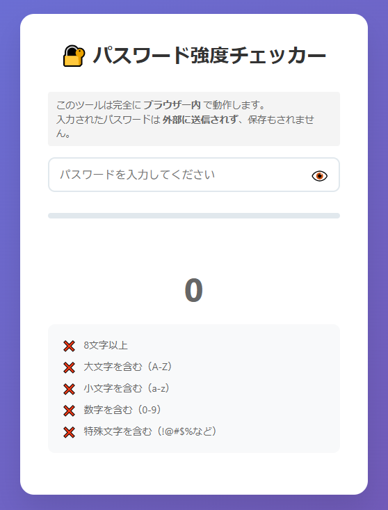

# 🔐 パスワード強度チェッカー

リアルタイムでパスワードの強度を評価する、日本語対応のWebアプリケーションです。

## 🌟 デモ

[https://ipusiron.github.io/password-checker/](https://ipusiron.github.io/password-checker/)

## 📸 スクリーンショット



## ✨ 機能

### 基本機能
- 🔍 **リアルタイム評価** - 入力と同時に強度を判定
- 📊 **視覚的な強度表示** - プログレスバーと色分けで直感的に理解
- 🔢 **スコア表示** - 0〜100点で数値化
- 👁️ **パスワード表示/非表示** - プライバシーを保護

### 評価基準
- ✅ 8文字以上（20点）
- ✅ 大文字を含む（A-Z）（20点）
- ✅ 小文字を含む（a-z）（20点）
- ✅ 数字を含む（0-9）（20点）
- ✅ 特殊文字を含む（!@#$%など）（20点）

### ボーナスポイント
- 12文字以上: +10点
- 16文字以上: +10点

### ペナルティ
- よく使われる危険なパスワード: -50点
- 同じ文字の連続: -10点

### 強度レベル
- 🔴 **非常に弱い** (0-20点)
- 🟠 **弱い** (21-40点)
- 🟡 **普通** (41-60点)
- 🟢 **良い** (61-80点)
- 🔵 **強力** (81-100点)

## 🚀 使い方

### オンラインで使用
1. [デモページ](https://ipusiron.github.io/password-checker/)にアクセス
2. パスワードを入力
3. リアルタイムで強度を確認

### ローカルで使用
1. リポジトリをクローン
```bash
git clone https://github.com/ipusiron/password-checker.git
```

2. プロジェクトフォルダに移動
```bash
cd password-checker
```

3. `index.html`をブラウザで開く
```bash
open index.html  # macOS
start index.html # Windows
xdg-open index.html # Linux
```

## 🛠 技術スタック

- **HTML5** - 構造
- **CSS3** - スタイリング（グラデーション、トランジション）
- **JavaScript** (Vanilla) - ロジックとDOM操作
- **正規表現** - パスワードパターンの検証

## 🛡️ 当プログラムは安全です

### 🔒 セキュリティ保証バナー
このツールは完全にローカルで動作します。
- パスワードは外部に送信されません。
- ブラウザにも保存されません。
- 入力データは即座に破棄されます。

### 💡 それでも不安な方へ　より安心して使うためのヒント

- プライベートブラウジング（シークレットモード）で使用する。
- インターネットを切断しても使えます。
- プログラムをダウンロードして、ローカル環境で実行する。
- ブラウザーのデベロッパーツールやパケットキャプチャーツールでネットワーク監視する。

## 応用

### カスタム辞書ファイルの利用

このツールでは、`common-passwords.txt` というプレーンテキスト形式のファイルを使って、「よく使われる弱いパスワード」をチェックしています。

このファイルは、一般の辞書ファイルと同様に**1行に1ワード**の形式になっています。

### 🔄 他の辞書ファイルを使いたい場合

大規模な辞書ファイル（例：`rockyou.txt`）から一部だけ取り出して使用することができます。

たとえば、先頭1000行を取り出して使いたい場合は、以下のコマンドを実行します。

```bash
head -n 1000 /path/to/rockyou.txt > common-passwords.txt
```

## 📝 ライセンス

[MIT License](LICENSE) - ご自由にお使いください。

## 👏 クレジット

- アイコン: ネイティブ絵文字を使用
- フォント: システムフォント
- カラーパレット: カスタムグラデーション

## 📞 連絡先

- GitHub: [@ipusiron](https://github.com/ipusiron)

---
